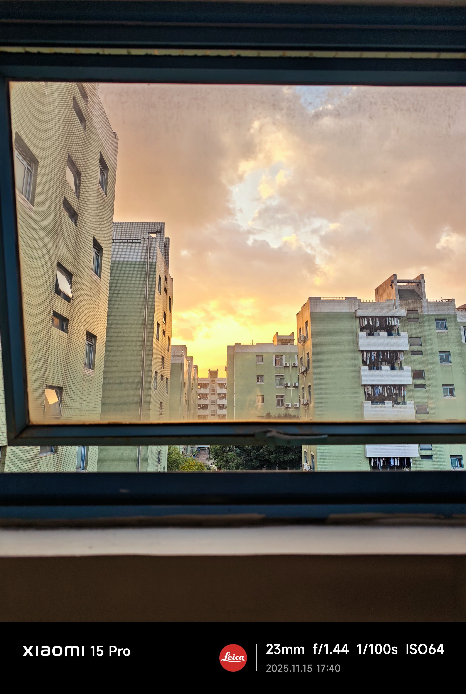

终于考完半期了，可以暂时休息一会。
宇宙很大，生活更大。
低头做题的同时，要记得向尘世之外瞥一眼。
> 云天明发现何博士似乎对自己的话并没没感到吃惊，只是默默地点了一支烟，也许，他已经察觉到了什么。沉默许久后，他说：“真那样的话，你仍然很幸运，大多数人，到死都没向尘世之外瞥一眼。” 何博士吐出的烟雾飘过云天明而前，使那颗黯淡的星星闪动起来。云天明想，当程心看到这颗星时，自己已不在人世了。其实，他和程心看到的这颗星星，是它在二百八十六年前的样子，这束微弱的光线在太空中行走了近三个世纪才接触到他们的视网膜，而它现在发出的光线，要二百八十六年后才能到达地球，那时程心也不在人世了。 她将度过怎样的一生呢？但愿她能记得，茫茫星海中，有一颗星星是属于她的。

（拍摄于四川大学江安校区西园七舍七单元）
