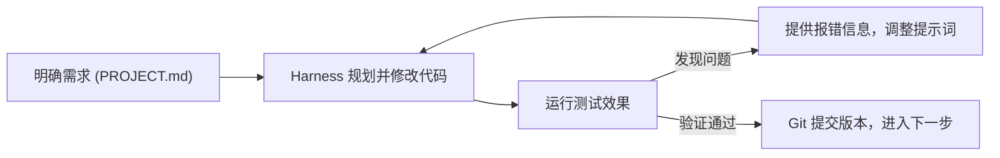

# Vibe Coding 入门指南

---

## 目录
1. [什么是 Vibe Coding？](#一什么是-vibe-coding)
2. [工具选型：VS Code 与 Harness](#二工具选型vs-code-与-harness)
3. [7 天极简路线](#三7-天极简路线)
   - [Day 1：工具基座与版本管理](#day-1工具基座与版本管理)
   - [Day 2：CS 本科多语言开发环境与 Git 纪律](#day-2cs-本科多语言开发环境与-git-纪律)
   - [Day 3：Agent Harness 就位与规划工作流](#day-3agent-harness-就位与规划工作流)
   - [Day 4：代码调试与双 Harness 协作](#day-4代码调试与双-harness-协作)
   - [Day 5：项目实战一：全栈 DDL 管理器（FastAPI + SQLite + 前端）](#day-5项目实战一全栈-ddl-管理器fastapi--sqlite--前端)
   - [Day 6：项目实战二：Node.js 工程化 Canvas 游戏与公网部署](#day-6项目实战二nodejs-工程化-canvas-游戏与公网部署)
   - [Day 7：复盘总结与计算机专业进阶](#day-7复盘总结与计算机专业进阶)
4. [常见问题与实用技巧](#四常见问题与实用技巧)
5. [附录 A：可选高级配置与第三方模型接入（CC Switch 与 API 方言）](#附录-a可选高级配置与第三方模型接入cc-switch-与-api-方言)
6. [附录 B：纯命令行 Git 入门](#附录-b纯命令行-git-入门)

---

## 一、什么是 Vibe Coding？

2025 年初，OpenAI 联合创始人 Andrej Karpathy 提出了 **Vibe Coding** 的概念：
> *“我只是看着屏幕、说说需求、运行代码、复制粘贴，它大部分时候就能工作……我已经完全沉浸在 Vibe Coding 模式中了。”*

### 核心转变：从手写语法到主导设计
- **传统编程**：开发者需要熟记语言语法、处理类型与内存细节，花费大量时间手动敲入每一行代码。
- **Vibe Coding**：AI 负责具体的代码实现与语法细节；开发者聚焦于**需求拆解、架构设计、流程把控与功能测试**。
- **特别说明**：Vibe Coding 绝非“不管代码、随缘生成、盲目接受”。**本指南教的是有工程纪律的版本**——你掌控需求拆解、架构设计、审查 Diff（改动对比）、分步验证与版本管理，AI 在你的严密把控下高效交付。




### 边界：AI 不能替你做什么
AI 能替你完成基础编码，但无法替代计算机基础思维。模块设计、数据流向、边界条件以及系统底层逻辑，依然由你掌控。对数据结构、操作系统和网络原理理解越清晰，你给出的提示词就越精准，诊断复杂代码问题的效率也就越高。

---

## 二、工具选型：VS Code 与 Harness

在工具架构上，推荐采用 **“通用代码编辑器（VS Code）+ 专用编程助手（Harness）”** 的协作模式。

### 1. 为什么是 VS Code + Harness？
- **VS Code（代码与项目基座）**：业界最通用、生态最大的现代化代码编辑器，也是大学期间学习 Python、Java、C/C++、前端及各种系统开发的主流工具，拥有成熟庞大的扩展生态（语法高亮、实时预览、代码格式化、终端集成等）。
- **Harness（AI 编程助手）**：指**能自己读写工程文件、调用终端跑命令的专用工具**（Agent Harness 是业内叫法）。它具备整个项目的全局视野，能自主进行任务规划、跨文件检索与批量重构。
- **协同方式**：两者共同打开**同一个本地项目文件夹**。你在 Harness 中表达需求并指挥任务，在 VS Code 中实时查看代码改动、组织文件结构并进行测试与微调。

### 2. 主流 Harness 对比与推荐

每个 Harness 在使用自家的官方模型时体验最好（Codex 配 GPT，Claude Code 配 Claude，DeepSeek Harness 配 DeepSeek，ZCode 配 GLM，Kimi Code 配 Kimi）。

以下主流工具**按推荐顺序排列**：

| 推荐顺序 | Harness | 对应主力模型 | 特点与优势 |
| :---: | --- | --- | --- |
| 1 | **Codex App** | GPT 系列 (OpenAI) | OpenAI 官方桌面端编码工具，深度集成 GPT 编程能力；需国际网络与订阅 |
| 2 | **Claude Code Desktop** | Claude 系列 (Anthropic) | 官方桌面端多会话多任务应用，代码架构理解与生成能力极强；需国际网络与订阅 |
| 3 | **DeepSeek Harness** | DeepSeek 系列 | DeepSeek 官方开源的插件化框架，架构灵活，调用成本极低；依赖 Node.js 环境运行 |
| 4 | **ZCode** | GLM 系列 (Z.ai / 智谱) | 官方 ADE 独立环境，国内直连免代理，支持微信/支付宝，集成文件管理与终端 |
| 5 | **Kimi Code** | Kimi 系列 (Moonshot) | 官方编码助手，长上下文理解能力出色，国内直连稳定 |

> **选型策略**：
> - **遵循“先环境、后 Harness”的顺序**：切勿在未安装语言环境时提前装 Harness。Day 1 准备好网络、VS Code 与 Git 基座；Day 2 安装好包括 Node.js 在内的多语言开发环境；Day 3 再正式配置 Harness（例如 DeepSeek Harness 官方明确要求 Node.js 运行时，提前配好环境才能避免运行依赖报错）。
> - **先选 1 款作为主力**：若具备国际网络与订阅条件，优先选择 **Codex App** 或 **Claude Code Desktop**；若无外币卡或处于国内网络环境，建议选择免代理直连的 **DeepSeek Harness**、**ZCode** 或 **Kimi Code**（*若想用 Claude Code / Codex 的工作流但没有官方订阅条件，可参阅[附录 A](#附录-a可选高级配置与第三方模型接入cc-switch-与-api-方言)接入国产模型 API*）。
> - **Day 4 调试日再配置第 2 款作为备用**：避免初期配置过载，同时在后续遇到疑难 Bug 时拥有备用模型支持。

### 3. 版本管理辅助工具
1. **GitHub 账号**：代码托管与展示平台。后续可申请 GitHub Student Developer Pack 权益。
2. **GitHub Desktop**：GitHub 官方图形化客户端。通过可视化界面完成仓库同步与版本提交，无需初期记忆复杂的 Git 命令行。

---

## 三、7 天极简路线

### Day 1：工具基座与版本管理
**目标**：完成网络准备，安装并配置专业代码编辑器 VS Code 与 GitHub Desktop，跑通第一个本地网页预览。

#### 1. 网络准备（关键前提）
Codex App、Claude Code Desktop 以及 VS Code 插件市场等工具需要顺畅的网络环境。
- 前往 GitHub Releases 下载图形化代理客户端（如 [Clash Party](https://github.com/mihomo-party-org/clash-party/releases)、[Clash Verge Rev](https://github.com/clash-verge-rev/clash-verge-rev/releases/) 或 [FlClash](https://github.com/chen08209/FlClash/releases/) 任选一款）。若下载缓慢，用手机热点或请同学发安装包。
- 导入你的服务订阅，开启“系统代理”。
- 在浏览器中测试验证，确保能正常打开 `github.com` 与 `marketplace.visualstudio.com`（GitHub Desktop 和 VS Code 插件市场是今天真正要用的；也可访问 `youtube.com` 作为附加验证）。
- *提示*：若使用国产模型（如 DeepSeek、智谱、Kimi），其官方 API 域名建议在代理软件中设置为“直连”，不走代理连接反而更稳定流畅。

#### 2. 安装 VS Code
VS Code 是本周乃至整个大学专业课的“操作台”：查看代码、管理项目文件、运行终端命令都在这里完成。整个过程约 10~15 分钟，请按顺序操作。

**(1) 下载安装包**
- 打开 [code.visualstudio.com](https://code.visualstudio.com/)，点击首页中央的蓝色大按钮 **Download for Windows**（网站会通过浏览器识别系统，Mac 用户会看到 Download for Mac）。
- Windows 下载得到的是 `VSCodeUserSetup-x64-x.xx.x.exe`。
- Mac 用户下载后得到一个 `.zip`，解压后把 `Visual Studio Code.app` 拖进“应用程序（Applications）”文件夹即可。
- *提示*：若官网下载卡在 0% 或速度极慢，说明第 1 步的代理尚未生效，先回去检查“系统代理”是否开启。

**(2) 运行安装程序（Windows）**
1. 双击安装包，勾选“我同意此协议”，点击“下一步”。
2. 安装位置保持默认即可，连续点“下一步”。
3. 到达 **“选择附加任务”** 页面时，这是最关键的一步，请勾选以下选项：
   - ☑ **将“通过 Code 打开”操作添加到 Windows 资源管理器文件上下文菜单**
   - ☑ **将“通过 Code 打开”操作添加到 Windows 资源管理器目录上下文菜单**
   - ☑ **添加到 PATH（重启后生效）**
   - ☑ 创建桌面快捷方式（可选，方便找到）
   - **为什么要勾这些**：前两项让你以后在任意文件夹上右键就能“通过 Code 打开”，省去每次在软件里找路径；“添加到 PATH”让终端和工具能通过 `code` 命令直接呼出 VS Code。
   - *注意*：另有一项“将 Code 注册为受支持的文件类型的编辑器”不建议勾选，否则以后双击 `.txt`、`.md` 等文件都会默认用 VS Code 打开。
4. 点击“安装”，等待进度条走完，勾选“运行 Visual Studio Code”后点击“完成”。
- *Mac 用户补充*：打开 VS Code，按 `Cmd+Shift+P` 打开命令面板，输入 `Shell Command: Install 'code' command in PATH` 并回车，即可在终端使用 `code` 命令。

**(3) 首次启动与中文化**
- 首次打开是英文界面，右下角可能弹出欢迎页，直接关掉即可。
- 按快捷键 `Ctrl+Shift+X`（Mac 为 `Cmd+Shift+X`）打开左侧 **扩展市场（Extensions）**。
- 在顶部搜索框输入 `Chinese`，找到 **Chinese (Simplified) (简体中文) Language Pack for Visual Studio Code**（发布者为 Microsoft，带蓝色对勾），点击 **Install**。
- 安装完成后右下角会弹出提示 **“Change Language and Restart”**，点击它，VS Code 会自动重启并变为中文界面。
- *若没有弹出提示*：按 `Ctrl+Shift+P` 打开命令面板，输入 `Configure Display Language`，回车后选择 `中文(简体)`，再点击“重启”。

**(4) 安装 Live Server（网页实时预览）**
- 再次打开扩展市场，搜索 `Live Server`，选择发布者为 **Ritwick Dey**、下载量最高的那一个，点击“安装”。
- **它的作用**：本地双击 `.html` 文件也能在浏览器打开，但 Live Server 会启动一个本地小服务器（地址形如 `http://127.0.0.1:5500`），并且**你每次保存文件，浏览器都会自动刷新**。
- 安装完成后，VS Code 窗口最底部的状态栏右侧会出现 **Go Live** 按钮，这就是启动入口。

**(5) 用 2 分钟认识界面**
- **左侧活动栏（竖排图标）**：最上面的“资源管理器”显示当前打开文件夹的文件树；“扩展”就是刚才用的应用商店。
- **中央编辑区**：点击文件树中的文件即可在此查看和修改代码。
- **底部面板 / 终端**：按 `` Ctrl+` ``（数字 1 左边的反引号键）可以呼出内置终端。Day 2 起会在这里运行环境自检与各种命令。
- **底部状态栏**：显示当前文件类型、行号以及 Live Server 的 **Go Live** 按钮。
- *打开文件夹的方式*：菜单 `文件` → `打开文件夹`，或直接在资源管理器中对某个文件夹右键 → “通过 Code 打开”。弹出“是否信任此文件夹的作者”时点击 **“是，我信任此作者”** 即可。

**(6) 开启自动保存**
- 菜单 `文件` → 勾选 `自动保存`。初学者最常见的困惑是“改了代码为什么页面没变化”，原因往往是没按 `Ctrl+S` 保存；开启后即可避免，Live Server 也能随之自动刷新。

#### 3. 安装 GitHub Desktop 并建立首个仓库
- 前往 [desktop.github.com](https://desktop.github.com/) 下载并安装，登录你的 GitHub 账号。
- 点击 `File` → `New Repository`，名称填写 `vibe-coding-101`，本地路径选一个易记的英文目录（如 `D:\projects`）。
- 勾选 `Initialize this repository with a README`，点击 `Create Repository`。
- 点击右上角 **Publish repository**，将仓库发布同步到 GitHub 云端。
- **说明**：本周前几天的所有练习代码均存放在该仓库目录下。

#### 4. 初始体验：在 VS Code 中跑通第一个网页
此时还没有安装 Agent Harness。为了先体验最原始的 Vibe Coding 工作方式，可以直接打开任意网页版 AI 聊天工具，例如 ChatGPT、DeepSeek 或 Kimi，把需求发给它，让它生成代码，再复制到 VS Code 中运行。

这一步主要体验“自然语言提出需求 → AI 生成代码 → 复制到编辑器 → 实际运行”的最基础闭环。Day 3 安装 Harness 后，再体验 AI 直接读取和修改整个项目的区别。

1. 在 **VS Code** 中点击 `文件` → `打开文件夹`，选择刚才建立的 `vibe-coding-101` 目录。
2. 新建文件 `index.html`。
3. 打开已有的网页版 AI（无需注册新工具，ChatGPT / DeepSeek / Kimi 均可），发送以下需求 Prompt：
   ```text
   请生成一个单文件 index.html 倒计时网页。

   要求：
   1. HTML、CSS、JavaScript 全部写在一个文件中；
   2. 页面居中显示“我的倒计时”；
   3. 提供日期选择器；
   4. 页面首次打开时，默认目标日期自动设置为当前日期之后 30 天；
   5. 实时显示剩余天、小时、分钟、秒；
   6. 不使用任何外部框架或第三方库；
   7. 代码直接完整输出，我会复制到 VS Code 中运行。
   ```
4. 将 AI 完整输出的代码复制并粘贴到 VS Code 的 `index.html` 中保存。
5. 在编辑区右键选择 `Open with Live Server`（或点击右下角 **Go Live**），浏览器会自动打开网页并跳动显示倒计时。
6. 尝试在 VS Code 中修改一行标题文本，由于开启了自动保存，切到浏览器时页面已自动刷新完成更新！

#### 今日验收
- [ ] 代理配置可用，能顺畅打开 GitHub 与 VS Code 插件市场
- [ ] VS Code 与 GitHub Desktop 安装完成，已开启自动保存，`vibe-coding-101` 仓库已发布到 GitHub
- [ ] 使用网页版 AI 成功生成并复制 `index.html`
- [ ] Live Server 能正常打开页面
- [ ] 默认目标日期为当前日期之后 30 天
- [ ] 能修改日期，并实时更新剩余天、时、分、秒

---

### Day 2：CS 本科多语言开发环境与 Git 纪律
**目标**：搭建计算机专业本科核心技术栈基础环境（Python、Node.js、JDK、C/C++），配置国内镜像源，掌握 Git 安全与版本后悔药（Discard / Revert）。

> **环境规划：本周刚性依赖与 CS 本科开发基座**
> 计算机专业培养体系涵盖系统底层、核心算法、企业级工程与现代化工具链。为了避免后续课程与实战反复折腾配置，Day 2 将开发环境分为两类进行安装：
> - **本周项目刚性依赖**：
>   - **Python**：Day 5 全栈后端（FastAPI + SQLite）与自动化脚本。
>   - **Node.js**：Day 3 启动 **DeepSeek Harness**（基于 npx 运行）及 Day 6 使用 Vite 构建小游戏的刚性前置依赖。
>   - **Git**：版本管理与代码同步基石。
> - **CS 本科开发基座**：
>   - **JDK (Java)**：面向对象程序设计、数据结构经典教学与企业级后端核心。
>   - **C/C++ 编译器 (GCC/G++)**：程序设计基础、操作系统、计算机组成原理必须掌握的底层基石。
> - **安装节奏建议**：理想情况下 Day 2 一次配齐；如果当天时间不足，应优先保证 Python、Node.js、Git 可用，JDK 与 GCC/G++ 随后补齐，但在完成 Day 2 最终环境建设前仍建议全部安装完成。

#### 1. 安装 Python 3.12+
- 前往 [python.org](https://python.org/) 下载 3.12 或 3.13 稳定版。
- **关键操作**：在安装首界面务必勾选 **☑ Add python.exe to PATH**！
- Windows 自检使用 `python --version`；macOS 从 python.org 安装 Python 后，常见命令为 `python3`，因此 Mac 用户优先验证：
  ```bash
  python3 --version
  ```
  避免因 `python` 命令不存在而误以为安装失败。
- 配置国内镜像加速（重启 VS Code 后在内置终端执行）：
  ```bash
  pip config set global.index-url https://pypi.tuna.tsinghua.edu.cn/simple
  ```

#### 2. 安装 Node.js LTS（含 npm / npx）
- 前往 [nodejs.org](https://nodejs.org/) 下载标注 **LTS（长期支持版，如 Node.js 24 LTS）** 的安装包，一路默认“下一步”安装即可。
- 安装完成后会自动附带 `npm` 与 `npx` 工具。
- 配置国内 npm 镜像加速（在内置终端执行）：
  ```bash
  npm config set registry https://registry.npmmirror.com
  ```
- **重要说明**：这一步彻底解决了“先装 Harness 却因缺少 Node.js 导致启动失败”的依赖断裂问题。Node.js / npm / npx 是 Day 3 某些 Harness（如 DeepSeek Harness）的运行前提，也是 Day 6 使用 Vite 构建小游戏的刚性依赖。

#### 3. 安装 JDK LTS (Java 17 或 21)
- 前往主流开源发行版 [adoptium.net](https://adoptium.net/) 下载 Eclipse Temurin 的 LTS 版本（Java 17 或 21）。
- Windows 安装包在自定义设置页面中，确保勾选了 **Set JAVA_HOME variable** 与 **Add to PATH**。
- 计算机专业的面向对象程序设计与经典数据结构课程大多以此为基石。

#### 4. 安装 C/C++ 编译环境 (MinGW-w64 / GCC)
- **Windows 极简推荐**：下载免安装纯净版 MinGW-w64（如 [w64devkit](https://github.com/skeeto/w64devkit/releases) 或 [winlibs](https://winlibs.com/)），解压至无中文路径（例如 `C:\mingw64`），将其 `bin` 目录添加到系统的 `Path` 环境变量中。
  - **Windows GUI 配置 Path 步骤**：
    ```text
    Win 键搜索“编辑系统环境变量”
    → 打开“系统属性”
    → 环境变量
    → 在 Path 中点击“编辑”
    → 新建
    → 填入 MinGW 的 bin 目录，例如 C:\mingw64\bin
    → 一路确定
    → 彻底重启 VS Code
    ```
    *注：若实际解压路径不同，填入对应的实际 `bin` 目录。*
- **Mac 用户**：直接在终端执行 `xcode-select --install` 安装 Command Line Tools。
- **Ubuntu / Debian 用户**：终端执行：
  ```bash
  sudo apt update
  sudo apt install -y build-essential
  ```
  其他 Linux 发行版请使用对应的包管理器安装 GCC/G++。
- 这是大一学习 C 语言程序设计、后续深入操作系统与计算机组成原理必不可少的工具链。

#### 5. 安装 Git
- **Windows 用户**：
  - 前往官网下载安装包：[git-scm.com](https://git-scm.com/)
  - 下载 Git for Windows，运行安装程序，使用默认推荐设置安装；
  - 安装完成后彻底重启 VS Code；
  - 在终端执行：
    ```bash
    git --version
    ```
    确认正确输出版本号。
- **macOS / Linux 用户**：在终端执行 `git --version` 确认安装。若未安装，macOS 会提示安装 Command Line Tools，Linux 用户按各自包管理器安装即可。
- **说明**：系统 Git 是开发基座之一，后续工具链也可能依赖它。本节仅负责安装与环境验证，具体的 Git 命令行操作（如 `add`、`commit`、`pull`、`push` 等）全部保留在[附录 B：纯命令行 Git 入门](#附录-b纯命令行-git-入门)中深入学习。

#### 6. 环境变量避坑与 Windows 综合自检
- **避坑铁律**：凡是新安装了会写入 PATH 的程序，都**必须彻底关闭并重启 VS Code**，其内置终端才能读到新的环境变量。
- **综合环境自检**（重启 VS Code 后在内置终端中执行）：
  - **Windows 命令**：
    ```bash
    python --version
    node -v
    npm -v
    java -version
    javac -version
    gcc --version
    g++ --version
    git --version
    ```
  - **macOS / Linux 说明**：macOS / Linux 用户由于不同发行版、Shell 和包管理器环境存在差异，可以把自己的系统版本、发行版和当前安装情况告诉 AI，让 AI 为当前设备生成对应的安装与自检命令。
- **命令验证重点**：
  - `python` 验证 Python 解释器；
  - `node` 与 `npm` 验证 Node.js 运行时与包管理器；
  - `java` 验证 Java 运行时（JRE）；
  - `javac` 验证 Java 编译器（JDK）；
  - `gcc` 验证 C 语言编译器；
  - `g++` 验证 C++ 语言编译器（Windows MinGW 附带）；
  - `git` 验证系统 Git CLI 工具。
  如果全部正确输出版本号（未提示“找不到命令”或弹出 Windows 应用商店），说明多语言开发基座已全部就位！

#### 7. 安全规范与 Git 纪律
公开仓库中若泄露敏感配置会导致安全风险。
1. **生成全能 `.gitignore`**：在 `vibe-coding-101` 项目根目录下创建 `.gitignore`，写入针对 Python、Node、Java、C/C++ 与 SQLite 的通用忽略项：
   ```gitignore
   # 敏感密钥与本地配置（绝对禁止提交）
   .env
   *.local

   # Python
   __pycache__/
   *.pyc
   .venv/

   # SQLite 本地数据
   *.db
   *.sqlite
   *.sqlite3

   # Node
   node_modules/
   dist/

   # Java
   *.class
   target/

   # C/C++
   *.o
   *.exe
   *.out
   ```
   **安全铁律**：API Key 绝不进代码、绝不进仓库（完整规范见第四节）。
2. **掌握 Git 的两套“撤销与后悔”操作**：
   - 打开 Day 1 使用过的网页版 ChatGPT / DeepSeek / Kimi，要求它生成一个简单的 Python 猜数字程序 `game.py`，发送以下 Prompt：
     ```text
     请写一个适合 Python 初学者的猜数字小游戏。

     要求：
     1. 使用 random.randint 随机生成 1~100 的整数；
     2. 使用 while 循环让用户重复输入；
     3. 用 input() 获取用户输入；
     4. 猜大了提示“太大了”，猜小了提示“太小了”；
     5. 猜中后输出尝试次数并结束；
     6. 只使用 Python 标准库；
     7. 代码控制在 30 行以内；
     8. 直接输出完整 game.py 代码。
     ```
   - 将 AI 输出的代码复制到 VS Code 中新建的 `game.py`，保存并在终端运行 `python game.py`（Mac 用户 `python3 game.py`）简单测试。
   - 打开 GitHub Desktop，在左下方填写摘要（如“添加猜数字小游戏”），点击 **Commit to main**，再点击 **Push origin** 推送到云端。
   - **练习操作 A（丢弃未提交的修改）**：在 VS Code 中随意改坏几行代码并保存。回到 GitHub Desktop，在更改的文件上右键点击 **Discard Changes**，本地文件会瞬间还原。
   - **练习操作 B（回退已提交的历史版本）**：先修改一处代码（例如修改欢迎语），在 GitHub Desktop 中单独 commit 一次（摘要如“修改欢迎语”）。在左侧切换到 **History** 标签页，右键选中该 Commit，点击 **Revert changes in commit**。观察欢迎语恢复原样而 `game.py` 依然存在。Git 会自动生成一次反向修改的新提交，安全撤销历史更改。

> [!TIP]
> **想进一步掌握 Git 命令行？**
> GitHub Desktop 足以完成本周的基础版本管理，但作为计算机专业学生，建议在熟悉图形化操作后进一步理解 Git CLI。
> 可以继续阅读[附录 B：纯命令行 Git 入门](#附录-b纯命令行-git-入门)，学习 `status → diff → add → commit → push` 的终端工作流。

#### 今日验收
- [ ] Python、Node.js、JDK、C/C++ 与 Git 环境全部就位，综合自检命令全部通过
- [ ] 根目录下已创建包含密钥保护与 SQLite 本地数据忽略规则的 `.gitignore`
- [ ] 使用网页版 AI 生成 `game.py`，并在 GitHub Desktop 中实际跑通了一次 `Discard Changes` 与一次 `Revert changes in commit`

---

### Day 3：Agent Harness 就位与规划工作流
**目标**：安装配置主力 Harness，掌握结构化提示词规范与项目规则文件（优化工程约束），跑通第一个 Harness 驱动的规划与开发闭环。

#### 1. 安装与启动主力 Harness（1 款）
依据第二节的推荐选择 1 款工具：
- 若使用 **Codex App** 或 **Claude Code Desktop**：前往官网下载客户端完成安装与登录。
- 若使用 **DeepSeek Harness**：得益于 Day 2 已经安装好 Node.js，直接在终端执行官方命令即可无缝拉起 Web 交互界面：
  ```bash
  npx @deepseek-ai/dsh web
  ```
- 若使用 **ZCode** 或 **Kimi Code**：下载对应官方客户端并登录。
- **安全权限提醒**：初次使用请务必保持默认的“每次执行前手动确认/批准”模式，**第一周严禁开启“全自动 / 自动批准（Auto-approve / YOLO）”模式**。AI 执行终端命令前必须人工过目，防止高危指令。
- *提示*：若需要将 Claude Code / Codex 等成熟工作流接入国产大模型，可参阅[附录 A](#附录-a可选高级配置与第三方模型接入cc-switch-与-api-方言)。

#### 2. 结构化提示词四要素
对具备自主执行能力的 Harness，单纯设定“角色”意义有限，真正决定质量的是以下四个要素：**背景说明 + 核心功能 + 明确约束 + 验收方式**。

| 模糊表述（容易发散偏航） | 结构化表述（质量与边界可控） |
| --- | --- |
| 帮我写个倒计时工具 | **背景**：用于记录学期重要考试与 DDL 的网页工具。<br>**功能**：纯前端实现，支持添加自定义事项、手动调整目标日期（默认设为下一次元旦）；实时显示剩余天、时、分、秒。<br>**约束**：数据存入 LocalStorage，刷新页面不丢失；页面极简深色风格，单个 HTML 文件包含完整 CSS/JS。<br>**验收方式**：在浏览器打开后能正常倒计时；刷新页面已有事项保留；添加过去的时间会给出友好拦截提示。 |

#### 3. 需求文档 `PROJECT.md` 模板
在开展多步骤任务前，先在根目录创建 `PROJECT.md`，为 Agent 划定开发范围与验收标准：
```markdown
# 项目名称：学期倒计时看板

## 我要做什么
一个现代极简风格的纯前端 DDL 与学期倒计时看板。

## 核心功能
- [ ] 顶部醒目展示距离下一次元旦的实时倒计时（天、时、分、秒动态跳动）
- [ ] 支持点击日期选择器自定义目标时间，自动计算相对差距
- [ ] 支持添加多个备忘 DDL 任务列表，数据保存到浏览器 LocalStorage

## 约束条件
- 纯 HTML5/CSS3/JavaScript 单文件实现，不引入重型外部框架
- 默认目标日期必须动态计算为“下一次元旦”，切忌硬编码过去失效的年份常量
- 布局自适应屏幕宽度，支持深色夜间模式

## 验收方式
在 VS Code 中用 Live Server 打开，页面秒级动态刷新，刷新浏览器后自定义事项不丢失。
```

#### 4. 配置项目规则文件（性价比最高的一步）
主流 Harness 会在启动时自动读取项目规则文件：
- **Codex App** 使用：`AGENTS.md`
- **Claude Code Desktop** 使用：`CLAUDE.md`
- **其他 Harness**：不同 Harness 的项目规则文件名称、加载目录与优先级不同。如果官方文档没有明确声明支持 `AGENTS.md`，不要默认该工具会自动读取它。优先查阅当前 Harness 官方文档。

**规则文件标准内容模板**：
```markdown
- 全程使用中文进行对话和代码注释。
- 每次修改代码后，自行在终端运行测试，或详细指导我在浏览器中验证效果。
- 【核心工程纪律】：每轮只完成一个可独立验收的功能，不修改无关模块；如果预计涉及多个模块，先说明修改范围与影响，切忌随意重构无关代码。
- 每完成一个独立功能点并通过验证后，提醒我进行一次 Git Commit。
- 我是大一计算机专业学生，遇到关键算法、数据结构或系统调用时，请用一两句话解释底层原理。
```

> [!IMPORTANT]
> **警惕不良工程约束**：切勿设置诸如“单次修改不要超过 3 个文件”等机械的数字限制。这种死板规则会诱导 Agent 为了满足数字而把代码硬塞进少数文件，严重破坏软件的模块化与高内聚设计。正确的工程约束是**限定每轮的任务内聚性与修改范围**，不要限制文件个数。

#### 5. 今日实战练习（动手任务）
> **教学对比**：Day 1 的网页版 AI 通常无法直接访问和修改你本地工程文件，需要用户人工复制代码、报错和上下文；Day 3 的 Agent Harness 可以直接读取工程文件、跨文件检索、修改代码并运行终端命令，这就是两种工作流最直观的差别。

- 在 `vibe-coding-101` 仓库中新建 `PROJECT.md` 与对应的规则文件（`AGENTS.md` 或 `CLAUDE.md`）。
- 切换 Harness 至 **Plan（规划）模式**（若使用的工具没有独立开关，在对话中输入：*“请先完整阅读 PROJECT.md 与规则文件，给出分步实现计划，经我确认后再动手写代码”*）。
- 指挥 Harness 分步对 Day 1 的简易网页进行工程级升级重构，明确要求增加以下能力：
  1. **动态计算下一次元旦**（次年 1 月 1 日）作为默认主倒计时；
  2. 支持添加与管理**多个 DDL 任务列表**；
  3. 使用 **LocalStorage** 进行本地数据持久化；
  4. 保证**刷新页面数据不丢失**；
  5. 添加过去时间时进行友好的**输入校验与拦截提示**；
  6. 必要时对 Day 1 的简易代码进行**结构重构**。
- 审查 Diff 并确认修改，在 GitHub Desktop 中至少产生 3 次清晰独立的功能 Commit。

#### 今日验收
- [ ] 主力 Harness 成功安装并能正常调用模型
- [ ] 根目录包含规范的 `PROJECT.md` 与规则文件（采用健康的工程约束）
- [ ] 体验了 Plan（规划）模式，指挥 Harness 完成了 Day 1 网页的多任务与 LocalStorage 升级
- [ ] 审查改动 Diff，在 GitHub 产生至少 3 次清晰 Commit

---

### Day 4：代码调试与双 Harness 协作
**目标**：配置备用 Harness，掌握向 AI 准确反馈 Bug 的规范方法，攻克常见卡点。

#### 1. 安装与配置备用 Harness
- 在推荐列表中选择第 2 款工具作为备选（例如主力为 Codex App / Claude Code，备选可配置 DeepSeek Harness、ZCode 或 Kimi Code）。
- 确保备用工具能正常连接运行。在后续遇到棘手问题时，双模型交叉诊断能极大降低死锁概率。
- *说明*：若需要灵活切换不同模型供应商，可参阅[附录 A](#附录-a可选高级配置与第三方模型接入cc-switch-与-api-方言)。

#### 2. 结构化报错反馈方法
当程序运行异常时，不要只发“报错了”或“为什么不行”，向 Harness 提供以下三项完整信息：
1. **完整报错内容**：终端中的红字 Traceback，或浏览器控制台（F12 Console）中的报错文本全部复制。
2. **触发操作路径**：进行了什么输入、点击了哪个按钮后出现。
3. **预期与实际差异**：明确指出“预期应该输出 A，但实际出现了 B”。

配合约束指令限制其动作：
> *“请先分析报错的具体根因，说明需要修改哪几个模块的哪些逻辑，等我确认后再动手。不要改动不相关的功能代码。”*

#### 3. 应对三大高频卡点
- **卡点 A：AI 声称“已修复”但实际上没修好**：要求它在终端中实际运行测试命令，并粘贴完整的执行输出作为通过证据。
- **卡点 B：会话上下文过长导致胡说八道**：立即开启新会话（New Session），指令其：“重新阅读根目录下的 `PROJECT.md` 与规则文件，接管当前开发进度”。
- **卡点 C：同一个 Bug 反复陷入死循环**：停下当前工具，打开备用 Harness，将相同代码、需求与报错喂给备用模型重新诊断。

#### 4. 今日实战练习（构造与排查 Bug）
- **练习 A（语法报错排查）**：手动改坏一个变量名或拼错函数触发报错，将终端/控制台报错复制给 AI，体会标准报错信息的秒级定位。
- **练习 B（隐蔽逻辑 Bug 排查）**：在备用 Harness 中打开项目，让它故意植入一个无报错的真实逻辑缺陷（例如将 LocalStorage 写入的键名 `ddlTasks` 偷偷改为读取 `ddl_tasks`，导致“新任务当前能添加但刷新后全部消失”；或将日期边界判断 `<=` 偷偷改为 `<` 导致“恰好今天截止的任务行为异常”），要求其保持保密不解释改动。在 GitHub Desktop 中做一次中性提交（如“微调数据处理逻辑”）。随后切回主力 Harness，仅通过描述“预期表现与实际表现的差异”，引导 AI 精准找出并修复逻辑漏洞。

#### 今日验收
- [ ] 备用 Harness 安装就位，完成连通性测试
- [ ] 熟练掌握“完整报错 + 操作路径 + 预期差异”的结构化反馈三要素
- [ ] 成功排查并修复了人为构造的语法报错与逻辑 Bug，并在 Git 中完成提交

---

### Day 5：项目实战一：全栈 DDL 管理器（FastAPI + SQLite + 前端）
**目标**：脱离玩具脚本，建立独立项目仓库，构建计算机专业级别的前后端分层全栈应用：Python FastAPI 提供 RESTful API，SQLite 进行轻量数据持久化，前端 HTML/CSS/JS 进行动态交互，打通多语言协作闭环。

#### 1. 建立独立项目仓库并补齐 .gitignore
- 打开 GitHub Desktop，点击 `File` → `New Repository`，新建仓库 `ddl-manager`，Git Ignore 下拉选择 **Python**，点击 `Create Repository`。
- 创建本地仓库后，点击 GitHub Desktop 顶部的 **Publish repository**。在发布窗口中根据是否希望公开展示选择 Public / Private，然后完成发布。
- 将新仓库分别在 VS Code 与主力 Harness 中打开。
- **检查并补齐当前仓库的 `.gitignore`**：Day 2 的 `.gitignore` 属于 `vibe-coding-101` 仓库，不会自动作用于新建的 `ddl-manager`。打开 `ddl-manager` 根目录下的 `.gitignore`，检查 GitHub Desktop 自动生成的忽略规则并补齐缺失项，至少确保包含：
  ```gitignore
  .venv/
  .env
  __pycache__/
  *.pyc

  *.db
  *.sqlite
  *.sqlite3
  ```

#### 2. 全栈架构设计（编写 `PROJECT.md`）
引导 Harness 设计并实现一个轻量实用的全栈任务看板系统：
- **后端架构（Python FastAPI + SQLite）**：
  - 使用 Python 现代高性能框架 FastAPI 开发后端 RESTful 接口。
  - 使用 Python 内置的 `sqlite3` 数据库持久化存储数据（表字段设计：`id`, `title`, `deadline`, `urgency`, `is_done`）。
  - **数据库提交规范**：数据库文件（如 `tasks.db`）属于运行时本地数据，**不提交到 GitHub**（需在当前仓库的 `.gitignore` 中配置忽略规则）。项目首次启动运行时由程序自动检查并建表。
  - **SQLite 数据库工程约束**：
    - 不长期共享一个全局 `sqlite3.Connection`，避免多请求并发时的连接争用与状态混乱；
    - 数据库操作应按请求或操作粒度获取连接，并及时关闭，或使用统一的 context manager / FastAPI 依赖注入封装；
    - 所有 SQL 查询必须使用参数化查询（如 `cursor.execute("SELECT ... WHERE id = ?", (task_id,))`）；
    - 严禁直接把用户输入通过字符串拼接进 SQL 语句，防范 SQL 注入。
  - **时间格式与时区约定**：
    - `deadline` 在 API 与 SQLite 中统一使用 ISO 8601 格式字符串。本教学项目按用户浏览器所在本地时区解释和显示时间，前后端必须采用一致约定，避免一部分逻辑使用 UTC、一部分逻辑使用本地时间导致倒计时与预警计算偏差。
  - 提供标准 RESTful API：
    - `GET /api/tasks`（获取任务列表）
    - `POST /api/tasks`（新增任务）
    - `PATCH /api/tasks/{id}`（更新任务状态，请求体形如 `{"is_done": true}`；由客户端明确告诉后端希望任务最终处于什么状态，比单纯执行 toggle 更清晰健壮）
    - `DELETE /api/tasks/{id}`（删除任务）
- **前端架构（原生 HTML + CSS + JS）**：
  - 单页面仪表盘，通过原生 `fetch()` 异步调用后端 API（使用相对路径如 `fetch('/api/tasks')`，无需手工写死绝对地址）。
  - 动态计算倒计时剩余天数与小时，临近 24 小时的 DDL 自动标红预警。
  - 表单提交后无需刷新整页，前端无感异步刷新列表。

#### 3. 分步落地流程
1. **创建 Python 虚拟环境并安装依赖**：
   在 VS Code 内置终端中执行以下命令创建独立的虚拟环境：
   ```bash
   python -m venv .venv
   ```
   - Windows PowerShell 激活：
     ```powershell
     .venv\Scripts\Activate.ps1
     ```
     *若 PowerShell 提示脚本执行策略受限阻止激活，可切换到 Command Prompt 终端执行 `.venv\Scripts\activate.bat`，或者在 VS Code 中按 `Ctrl+Shift+P` → 输入并选择 `Python: Select Interpreter` → 选择当前项目下的 `.venv`。*
   - macOS / Linux 激活：
     ```bash
     source .venv/bin/activate
     ```
   - 在激活的虚拟环境中安装依赖：
     ```bash
     python -m pip install fastapi uvicorn
     ```
   - 导出依赖清单：
     ```bash
     python -m pip freeze > requirements.txt
     ```
   - **工程原理解释**：`pip freeze` 会同时记录 FastAPI、Uvicorn 以及它们安装的间接依赖，因此即使你只手动安装了两个包，`requirements.txt` 中出现十几项也是正常现象。后续学习 `uv`、Poetry 等依赖管理工具时，会接触更加现代的直接依赖管理方式。`.venv` 隔离每个项目的 Python 依赖库，避免污染全局环境；`.venv/` 已经在当前仓库的 `.gitignore` 中被忽略；`requirements.txt` 记录项目依赖，方便重新安装或团队协作。
2. **后端接口与自动文档体验**：
   - 让 Harness 编写 `main.py` 与 SQLite 初始化建表逻辑。
   - 终端运行后端：`uvicorn main:app --reload`。
   - 打开浏览器访问 `http://127.0.0.1:8000/docs`。这是计算机本科生必学的一课：体验 FastAPI 自动生成的交互式 Swagger API 文档，并在网页上手动测试接口的收发包与 JSON 数据结构。
3. **前端页面与前后端联调**：
   - **重要禁令：Day 5 不要再通过 Live Server 打开 `static/index.html`！**
     Day 1 的 Live Server 只适合纯前端静态页面。Day 5 已经有 FastAPI 后端，如果前端跑在 `127.0.0.1:5500`，而 API 跑在 `127.0.0.1:8000`，就会形成不同源请求，容易出现 404 或 CORS（跨域）问题。
   - **同源托管方案**：要求 Harness 将前端通过 FastAPI 直接提供，可采用方案 A（把页面挂在根路由 `http://127.0.0.1:8000/`）或方案 B（通过挂载静态目录访问 `http://127.0.0.1:8000/static/index.html`）。前端 API 统一使用相对路径 `fetch('/api/tasks')`，不硬编码端口。
   - 浏览器打开页面，录入数条示例数据（如“高等数学作业”、“程序设计实验”、“英语报告”），测试增删改查及 PATCH 状态更新。
   - 重启终端中的 Python 后端，刷新浏览器，验证 SQLite 本地数据库持久化有效，数据未丢失。
   - 在终端执行 `git status`，确认 `tasks.db`、`.venv` 等运行时文件没有出现在待提交文件列表中（确保当前仓库的 `.gitignore` 生效）。
4. **生成规范文档与提交代码**：让 Harness 编写包含架构说明、接口规范与本地运行指南的 `README.md`，在 GitHub Desktop 中完成提交并推送到远端仓库（*如果已经完成附录 B，可以尝试不用 GitHub Desktop，而是使用 `git status → git diff → git add → git commit → git push` 完成本次项目提交*）。

#### 今日验收
- [ ] 成功创建独立的 `ddl-manager` 仓库，补齐了 `.gitignore`，配置并激活了 `.venv` 虚拟环境，生成了 `requirements.txt`
- [ ] Python FastAPI 后端成功运行，能在 `/docs` 中查看并调试接口（更新接口采用 PATCH）
- [ ] 前端由 FastAPI 提供同源访问（未通过 Live Server 打开），相对路径 `fetch('/api/tasks')` 联调顺畅
- [ ] SQLite 本地数据库持久化有效，且 `tasks.db`、`.venv` 等运行时文件已被 `.gitignore` 忽略未提交至 Git
- [ ] 提交全部代码并推送到 GitHub 远端

---

### Day 6：项目实战二：Node.js 工程化 Canvas 游戏与公网部署
**目标**：使用现代前端 Node.js 工具链（Vite 脚手架）构建模块化 Canvas 互动小游戏，加入原创机制与移动端触控，并通过 GitHub Pages 部署上线供全球访问。

#### 1. 使用 Node.js 工具链初始化项目
在 Day 2 安装的 Node.js 与 npm 环境，今天正式展现现代软件工程的威力。
1. 在 GitHub Desktop 中点击 `File` → `New Repository`，新建仓库 `canvas-retro-game`，Git Ignore 下拉选择 **Node**，点击 `Create Repository`。
   - 创建本地仓库后，点击顶部的 **Publish repository**。在发布窗口中确保仓库最终为 **Public（公开）**，以便后续使用 GitHub Pages（GitHub Free 免费账户的 Pages 仅对公开仓库开放）。确认远程仓库已经建立后再进入后续开发。
2. 在 VS Code 终端中使用 Vite 现代前端脚手架初始化工程：
   ```bash
   npm create vite@latest . -- --template vanilla --no-immediate
   ```
   - **处理非空目录提示**：由于当前目录已经包含 GitHub Desktop 创建的仓库文件，终端可能会提示 `Current directory is not empty`。此时选择类似 **Ignore files and continue**（继续并忽略已有文件）的选项即可。
3. 安装依赖并启动本地开发服务：
   ```bash
   npm install
   npm run dev
   ```
   终端会输出本地开发地址（如 `http://localhost:5173`），支持极速热模块替换（HMR）。
4. **配置 Vite 的 `base` 路径**：
   在项目根目录下新建或修改 `vite.config.js`：
   ```javascript
   import { defineConfig } from 'vite'

   export default defineConfig({
     base: '/canvas-retro-game/'
   })
   ```
   - **为什么要配置 base**：GitHub Pages 部署的项目地址通常形如 `https://用户名.github.io/canvas-retro-game/`。如果不配置子路径，网页打包后引入的 JS/CSS 会默认从根域名根路径查找，导致 404 资源加载失败。如果你的仓库名不同，需将 `base` 同步修改为对应的仓库名。
5. 感受模块化开发优势：告别千行面条代码单文件，让 Harness 将游戏逻辑清晰拆分为 `main.js`（入口与循环）、`game.js`（核心实体逻辑）与 `style.css`。

#### 2. 迭代开发基础版本与移动端适配
在 Harness 中循序渐进推进：
1. **基础游戏循环**：
   - 使用 `requestAnimationFrame` 建立与浏览器刷新周期同步的动画循环。
   - **工程认知点**：不要将动画循环机械假设为“固定 60FPS”。现代不同屏幕可能是 60Hz、90Hz、120Hz 甚至 144Hz 刷新率，因此游戏逻辑不要假设每一帧时间固定为 1/60 秒。指挥 Harness 尽量使用前后两帧的时间戳差值（`deltaTime`）来计算角色位移与动画速度，保证在不同刷新率设备上移动速度一致。
2. **移动端适配（核心教学点）**：
   - 电脑端使用键盘方向键控制。
   - **手机端适配**：在画布下方增加虚拟方向按键，确保手机端可以正常操作。
3. **本地最高分记录**：使用 LocalStorage 记录历史最高分，刷新不丢失。

#### 3. 核心挑战：必须实现 1 项原创玩法机制
简单的基础游戏代码网上现成范例过多，无法检验你的控制力。**今天必须设计并让 AI 实现至少 1 个原创机制**：
- 例如贪吃蛇：吃到“金色沙漏”道具触发 5 秒子弹时间（减速）；或地图上动态生成激光障碍物；或增加“护盾果实”可免疫一次撞墙。
- 例如打砖块：不同颜色砖块击碎后掉落不同技能符文（多重分身球、加宽弹板）。

#### 4. 本地构建验证与 GitHub Actions 自动部署 Pages
*提示：已经掌握 Git CLI 的同学，可以尝试在本项目迭代中至少使用 3 次命令行 Commit，建立“完成一个独立功能 → 验证 → Commit”的工程节奏；未阅读附录 B 的同学继续使用 GitHub Desktop 即可。*

1. **本地生产打包与预览验证**：
   在项目根目录运行打包命令：
   ```bash
   npm run build
   ```
   - **工程原理解释**：是 **Vite** 工具链将你的 ES 模块化源码、CSS 资源进行编译、合并与压缩打包，最终输出到 `dist` 目录中（而不是由“Node.js 自动打包”）。
   - 运行本地生产预览命令：
     ```bash
     npm run preview
     ```
     在终端给出的地址中提前验证生产环境运行表现。
   - **重要说明**：生产产物 `dist/` 属于编译输出，已被 `.gitignore` 自动忽略，**切勿将 dist 手工 Commit 提交到仓库**。
2. **开启 GitHub Pages**：
   - 打开 GitHub 仓库网页端 → **Settings** → **Pages**。
   - 在 `Build and deployment` 的 **Source** 下拉菜单中选择 **GitHub Actions**。
   - **重要提醒**：在首次推送 Pages deployment workflow 之前，先将当前仓库的 Pages Source 设置为 **GitHub Actions**。
3. **配置 GitHub Actions 自动构建与部署**：
   未构建的 Vite 源码无法直接通过静态分支托管运行，必须由 CI/CD 构建出 `dist` 成品再发布。本教程统一使用官方推荐的 GitHub Actions 自动流：
   - 在项目根目录下创建 `.github/workflows/deploy.yml`，让 Harness 按照 Vite 官方规范编写自动部署工作流：
     ```yaml
     name: Deploy static content to Pages

     on:
       push:
         branches: ['main']
       workflow_dispatch:

     permissions:
       contents: read
       pages: write
       id-token: write

     concurrency:
       group: 'pages'
       cancel-in-progress: true

     jobs:
       deploy:
         environment:
           name: github-pages
           url: ${{ steps.deployment.outputs.page_url }}
         runs-on: ubuntu-latest
         steps:
           - name: Checkout
             uses: actions/checkout@v7
           - name: Set up Node
             uses: actions/setup-node@v7
             with:
               node-version: 24
               cache: 'npm'
           - name: Install dependencies
             run: npm ci
           - name: Build
             run: npm run build
           - name: Setup Pages
             uses: actions/configure-pages@v6
           - name: Upload artifact
             uses: actions/upload-pages-artifact@v5
             with:
               path: './dist'
           - name: Deploy to GitHub Pages
             id: deployment
             uses: actions/deploy-pages@v5
     ```
   - 将 `vite.config.js`、`.github/workflows/deploy.yml` 以及项目源码 Commit 并 Push 到 GitHub 的 `main` 分支。
4. **查看 Actions 部署**：
   - Push 后切到 GitHub 仓库网页端的 **Actions** 标签页，点击 `Deploy static content to Pages` 工作流。
   - 观察自动触发的流水线执行：依次完成 checkout → setup Node → `npm ci` → `npm run build` 打包 → upload artifact（上传产物）→ deploy Pages（部署上线）。
   - 等待 workflow 成功后在 Actions 页面或 Settings → Pages 获取专属公网链接（形如 `https://你的用户名.github.io/canvas-retro-game/`）。
5. **移动端实测**：
   - 用手机浏览器直接输入链接或扫码测试，体验虚拟按键，分享给同学试玩。

#### 今日验收

##### 1. MVP 核心验收（基础闭环）
- [ ] 熟练掌握 Node.js / Vite 工具链的运行、调试与本地打包（`npm run dev` / `npm run build` / `npm run preview`）
- [ ] 配置了正确的 `base: '/canvas-retro-game/'` 路径，处理了非空目录初始化情况
- [ ] 游戏基于 Canvas 能够流畅运行，键盘方向键控制正常
- [ ] 动画循环采用 `requestAnimationFrame` 配合 `deltaTime` 驱动平滑位移
- [ ] 使用 LocalStorage 记录历史最高分，刷新页面不丢失
- [ ] 产物 `dist/` 未手工提交至 Git，通过 GitHub Actions 成功自动化部署至 GitHub Pages
- [ ] 手机浏览器能成功打开公网在线页面

##### 2. 进阶目标（交互与原创）
- [ ] 画布下方实现手机端虚拟方向按键，手机上可操作游玩
- [ ] 成功设计并让 Harness 实现了至少 1 项原创玩法机制（如子弹时间、技能掉落、动态激光等）

##### 3. 挑战项（可选探索）
- [ ] 实现更复杂的原创机制组合或得分特效
- [ ] 处理移动端 DPR / Retina 屏幕的高清 Canvas 缩放适配

---

### Day 7：复盘总结与计算机专业进阶
**目标**：完成学习复盘，梳理技术盲区，规划大学后续的计算机核心进阶路径。

#### 1. 产出复盘文档
在 `vibe-coding-101` 仓库中新建 `REVIEW.md`（字数约 500~800 字），记录：
- 哪些提示词交互一次成功、哪些反复出现偏差，分析根本原因。
- 主力与备用两款 Harness 在代码生成、架构重构与查错时的体验差异。
- 列出本周遇到并记录下来的“底层知识盲区清单”（如浏览器事件循环、FastAPI 异步协程、RESTful 设计、Canvas 渲染机制等）。

#### 2. 利用 Harness 进行深度概念答疑
在 Harness 对话框中，针对清单上的盲区逐条提问：
> *“请结合 Day 5 的 FastAPI 项目与 Day 6 的 Canvas 游戏解释：*
> 1. *当我们使用同步的标准库 sqlite3 时，为什么路由可以写成普通 def？*
> 2. *FastAPI 中什么时候应该使用 async def？*
> 3. *如果未来把数据库换成真正支持 await 的异步数据库驱动，代码结构可能发生什么变化？*
> 4. *Day 6 为什么使用 requestAnimationFrame 而不是简单的 setInterval？”*

#### 3. 衔接大学计算机专业核心课程
本周你搭建的开发环境与工程思维，是大学核心专业课的最佳实践土壤：
1. **C/C++ 与底层系统课程（《程序设计基础》《操作系统》《计算机组成原理》）**：
   - Day 2 安装的 GCC/G++ 环境将伴随你的大学前两年。尝试用 C/C++ 编写一个命令行版链表或模拟简易操作系统的进程调度器，让 AI 深入解释指针、内存分布与段错误（Segmentation Fault）。
2. **Java 与企业级工程（《面向对象程序设计》《软件工程》）**：
   - Day 2 安装的 JDK 帮助你衔接后续的数据结构大作业与 Spring Boot 企业级实战。尝试体会强类型面向对象架构与设计模式的魅力。
3. **算法与数据结构实战**：
   - 在 LeetCode 刷题时，尝试先自己写出核心思路，让 Harness 为你构造极端边界反例（如空指针、超大数值溢出），培养严密的逻辑思维。
4. **GitHub Student Developer Pack**：
   - 有兴趣的学生可自行搜索 GitHub Education / Student Developer Pack，按照 GitHub 当前官方页面了解申请资格、材料和权益。

#### 今日验收
- [ ] 完成 `REVIEW.md` 复盘文档并提交入库
- [ ] 搞懂了盲区清单中的至少 2 个底层计算机核心原理
- [ ] 明确了后续专业课与多语言实践项目的衔接规划

---

## 四、常见问题与实用技巧

### 1. 修改陷入循环时的应对三板斧
1. **第一步（版本回退）**：立即在 Harness 中停止任务，打开 GitHub Desktop。
   - 若只是当前未提交的改动乱了，直接在 Changes 列表中的文件上右键点击 **Discard Changes** 瞬间还原；
   - 若已经连续提交了多次错误代码，切换到 **History** 标签页，**从最新的 Commit 开始由新到旧逐个点击【Revert changes in commit】**，一路安全回退到上一个正常运行的节点。
2. **第二步**：将需求进一步拆分细化，每次只提出一个单一、具体的修改指令。
3. **第三步**：如果主力 Harness 依然无法解决，切换到备用 Harness 重新描述问题。

### 2. 安全与权限防线

#### (1) Agent 终端权限
- **第一周坚决不开全自动模式（Auto-approve / YOLO）**：AI 每次执行终端命令前必须人工过目确认。
- **警惕高危文件操作**：对涉及 `rm`、`del`、`git reset --hard`、批量移动或覆盖文件的指令保持警惕，防止误删或弄乱本地真实文件。

#### (2) API Key 规范管理与泄露应急
- **正确做法（.env + 环境变量 + .gitignore）**：
  1. 敏感 Key 存入本地根目录的 `.env` 文件。
  2. 确保 `.gitignore` 中已写入 `.env`，彻底阻断 Git 追踪。
  3. 代码通过环境变量读取（如 Python 的 `os.getenv`）。公开仓库可附带 `.env.example` 占位模板。
- **Key 泄露应急处理**：Key 一旦被 Commit 并推送到远端，即使后来从当前代码中删除，也仍可能存在于既有 Git 历史、远程仓库副本或其他已获取的副本中。因此一旦发生泄露，应立即在厂商后台作废旧 Key 并重新生成。后续清理 Git 历史只能作为补救措施，不能替代凭据轮换。

### 3. 工具与流程速查表
- **代码与项目基座**：VS Code（负责代码浏览、扩展插件与终端运行）。
- **开发环境**：Python (3.12/3.13) / Node.js 24 LTS / JDK 17/21 / GCC-G++ / Git。安装完成后需重启 VS Code，并通过 Day 2 的环境自检命令确认 PATH 配置正常。
- **编程助手（Harness）推荐排序**：
  1. Codex App（OpenAI / GPT）
  2. Claude Code Desktop（Anthropic / Claude）
  3. DeepSeek Harness（DeepSeek）
  4. ZCode（Z.ai / GLM）
  5. Kimi Code（Moonshot / Kimi）
- **版本控制与安全网**：GitHub Desktop（新手图形化操作，负责可视化提交、安全丢弃 Discard 与历史版本 Revert）+ Git CLI（推荐进阶，详见[附录 B](#附录-b纯命令行-git-入门)）。
- **标准开发闭环**：明确需求文档（`PROJECT.md`）→ Harness 规则约束 → 分步规划修改 → 运行验证 → Git 存档。
- **第三方模型切换**：若没有官方外币订阅条件，想要使用 Claude Code / Codex 工作流接入国内模型 API，请详细查阅[附录 A：可选高级配置与第三方模型接入](#附录-a可选高级配置与第三方模型接入cc-switch-与-api-方言)。

---

## 附录 A：可选高级配置与第三方模型接入（CC Switch 与 API 方言）

> [!NOTE]
> **适用场景**：如果你没有外币信用卡无法订阅 Claude Pro 或 ChatGPT Plus，但希望体验 Claude Code 或 Codex 的强大工程代理工作流，可以让这些工具“换上国产模型的大脑”。若你使用的是官方直连的国产 Harness（如 DeepSeek Harness、ZCode、Kimi Code），可直接跳过本附录。

### 1. 核心原理：Claude Code 与 Codex 常见的两类第三方模型兼容协议
Harness（工程驱动工具）和模型（底层大脑）在架构上是解耦的。不同 Harness 有各自的通信协议与扩展机制，例如 Claude Code 与 Codex 常见以下两类第三方模型兼容方式：
- **Claude Code 常见的 Anthropic-compatible 协议**：Claude Code 通常通过厂商提供的兼容 Base URL 与对应鉴权配置接入第三方模型。不同厂商使用的鉴权环境变量、模型映射与附加配置可能不同，请以目标厂商当前针对 Claude Code 的官方接入文档为准。
- **Codex 常见的 OpenAI Responses API 协议**：读取配置文件中的 `model_providers` 设置，通过兼容 OpenAI Responses API 规范的端点进行调用。
- **其他 Harness**：如 DeepSeek Harness、ZCode、Kimi Code 等原生客户端拥有自己的 Provider 抽象、插件系统或专用接口规范。

### 2. 国内主流模型 Coding 接口规范（更新基准）

| 厂商 | 给 Claude Code 用（Anthropic 方言兼容） | 给 Codex 用（OpenAI 方言兼容） | Coding 模型示例 | 说明 |
| :---: | --- | --- | --- | --- |
| **DeepSeek** | `https://api.deepseek.com/anthropic` | `https://api.deepseek.com` | `deepseek-v4-flash`<br>`deepseek-v4-pro` | 官方已演进至 V4 系列；Claude Code 可通过环境变量或别名映射模型档位 |
| **Kimi Code** | `https://api.kimi.com/coding/` | `https://api.kimi.com/coding/v1` | 请查阅 Kimi Code 当前官方模型列表 | **请特别注意**：Kimi Code 官方 Coding API 采用独立的 `api.kimi.com/coding` 端点，与 Moonshot 开放平台的通用 API 互为独立服务 |
| **智谱 GLM** | `https://open.bigmodel.cn/api/anthropic` | 请查阅智谱当前官方 Codex / Coding Plan 接入文档 | `glm-5.3` / 最新代码模型 | Coding PaaS 专线为大代码工程高并发设计 |

> [!TIP]
> **重要认知**：各大 AI 厂商的模型迭代速度极快，端点与模型 ID 会随着版本持续演进，表中仅为 Coding 模型示例。**具体有效的模型代号与完整接入规范请务必以各厂商开发者控制台当前官方“Coding API / 编程助手接入”文档为准**。

### 3. 图形化管理神器：CC Switch
手动编辑各个工具的底层 JSON/TOML 配置文件非常繁琐，极易因格式拼写错误导致启动失败。推荐使用开源的图形化切换工具 **CC Switch**。

- **仓库地址**：[github.com/farion1231/cc-switch](https://github.com/farion1231/cc-switch)
- **核心功能**：一键保存多家模型供应商的 Base URL、API Key 与模型参数；通过图形界面无缝切换 Claude Code 与 Codex 的当前大脑，切换时自动备份旧配置。
- **使用步骤**：
  1. 在厂商开发者控制台完成注册，创建专属 API Key（务必复制保存至安全位置）。
  2. 下载并安装 CC Switch，选择需要配置的工具标签页（Claude Code 或 Codex）。
  3. 点击“添加供应商”，选择预设厂商（如 DeepSeek、智谱、Kimi），粘贴 API Key 并保存。
  4. 点击“启用”，CC Switch 会自动改写底层的配置文件。
  5. **关键一步：彻底重启 Harness**！Harness 仅在启动初始化时读取一次配置，重启后输入 `/status` 查看端点与模型是否生效，并在厂商控制台观察用量消耗。

### 4. 不用 CC Switch 的底层手动配置参考
如果你希望了解底层机制，或在无 GUI 环境下部署，可直接手动修改配置文件（与 CC Switch 二选一即可）：

#### (1) Claude Code 手动配置
Claude Code 会在启动时从配置文件（如 `~/.claude/settings.json`，Windows 路径为 `C:\Users\你的用户名\.claude\settings.json`）或系统环境变量中读取 Base URL、API Key 与模型映射规则：
- Kimi Code 的 Anthropic-compatible Base URL 为 `https://api.kimi.com/coding/`（请注意与 Moonshot 通用开放平台区隔）；
- 认证环境变量应使用 `ANTHROPIC_API_KEY`；
- Kimi Code 针对 Claude Code 的配置项（包含模型 tier、上下文窗口、subagent 支持、模型别名等字段）更新速度很快，配置时请直接以 **Kimi Code 当前官方“Claude Code 接入”文档提供的完整配置模板**为准，复制写入 `settings.json` 即可。请勿仅手工修改单个模型字段或使用残缺模板，以免导致高级特性或子代理调用异常。

#### (2) Codex 手动配置
- **官方推荐方案（一键配置脚本）**：
  DeepSeek 官方提供了自动配置脚本，会自动写入所需的 `models.json` 与 `config.toml`：
  - **Windows (PowerShell)**：
    ```powershell
    irm https://cdn.deepseek.com/api-docs/codex-deepseek-setup-en.ps1 | iex
    ```
  - **macOS / Linux**：
    ```bash
    bash <(curl -fsSL https://cdn.deepseek.com/api-docs/codex-deepseek-setup-en.sh)
    ```
- **手动配置说明（备用方案）**：
  如果希望手工理解 Provider、model catalog、认证和 Responses API 配置，请直接参考 DeepSeek 当前官方 Codex 集成文档。相关配置项（如 `models.json` 中的 model catalog 与 `config.toml` 中的 provider 映射）会随 Codex 与 DeepSeek 版本迭代，本指南不长期复制易过期的完整配置快照。

#### (3) 桌面 App 不读取 Provider 配置时的兜底方式
如果桌面 App 没有读取第三方 Provider 配置，先确认该版本桌面 App 是否支持这套配置文件。如果不支持，请打开 Claude Code / Codex 当前官方文档，按照官方当前推荐方式安装并使用 CLI 版本验证 Provider 配置。

CLI 安装方式和包名可能随版本变化，因此以官方文档为准，不在本指南中长期硬编码安装命令。

### 5. 注意事项与安全防线
- **API Key 敏感安全铁律**：
  - API Key 属于极其敏感的高权限凭据。CC Switch、`~/.claude/settings.json`、`~/.codex/config.toml` 以及系统环境变量中均可能以明文或可读取形式保存 Key。
  - **严守安全边界**：绝对不要截图包含 Key 的界面发到交流群；不要将相关用户配置文件复制到项目仓库中；不要把 Key 写入 `README.md`；绝对禁止将 Key Commit 提交到 Git。
  - **泄露应急处置**：一旦怀疑或确认 Key 发生泄露，必须**立即前往对应厂商控制台作废（Revoke）旧 Key 并重新生成**，绝不能仅仅删除本地文件中的明文或覆盖 Git 提交。
  - **防盗刷与消费监控**：**如平台支持**，建议开启余额或用量提醒、消费限额等费用控制功能，并定期检查 Coding Plan / API 的使用量和费用，避免自动化任务异常造成意外消耗。
- **第三方兼容性折损**：第三方模型走 Claude Code / Codex 协议时，部分专属工具调用特性或深度思考反馈可能存在微小兼容性差异，遇到代码无关的报错，可先用小型任务测试连通性。模型代号、API 端点与 Provider 字段迭代迅速，请务必以各厂商开发者平台当前最新官方文档为准。

---

## 附录 B：纯命令行 Git 入门

> [!NOTE]
> 正文为了降低第一周的学习门槛，主要使用 GitHub Desktop 完成版本管理。但作为计算机专业学生，仍然建议掌握最基本的 Git 命令行操作。
>
> 本附录不会涉及复杂的 Branch、Rebase、Cherry-pick 等高级内容，只学习日常开发最常用的一条主线：
>
> **`status → diff → add → commit → push`**

### 1. Git 的四层结构与数据流向

理解 Git 命令行的关键，在于掌握代码改动在计算机中流转的**四层结构**：

```text
工作区 (Working Directory)
  │
  │ git add
  ▼
暂存区 (Staging Area / Index)
  │
  │ git commit
  ▼
本地 Git 仓库 (Local Repository)
  │
  │ git push
  ▼
GitHub 远程仓库 (Remote Repository)
```

远程同步的数据流向则相反：

```text
GitHub 远程仓库 (Remote Repository)
  │
  │ git pull
  ▼
本地仓库与工作区
```

#### 四层结构的含义
- **工作区（Working Directory）**：你在 VS Code 中正在查看、编辑的代码目录。你随时打字、修改、保存的文件都在这一层。
- **暂存区（Staging Area / Index）**：准备放入下一个版本的“打包工作台”。你可以挑选部分改动放进来，决定哪些改动将进入下一次提交。
- **本地 Git 仓库（Local Repository）**：本地电脑由 Git 维护的版本数据库（保存在项目根目录隐藏的 `.git` 文件夹中）。每当你执行一次提交，就会在这里生成一个正式的版本快照。
- **GitHub 远程仓库（Remote Repository）**：托管在云端服务器的代码仓库，用于代码备份、跨设备同步以及向他人展示你的作品。

#### 核心命令的数据流动
- `git add`：将工作区中挑选的文件改动放入**暂存区**（选择哪些修改进入下一次版本）；
- `git commit`：把暂存区中的所有修改打包保存为一个新版本，正式记入**本地 Git 仓库**；
- `git push`：把本地 Git 仓库中新生成的 Commit 上传至 **GitHub 远程仓库**；
- `git pull`：把 GitHub 远程仓库上的新版本同步拉取到**本地仓库与工作区**。

> [!IMPORTANT]
> **必须重点牢记：`git commit` 绝不等于上传 GitHub！**
> - `git commit` 完全是在你本地硬盘上记录快照，整个过程**不需要连接网络**。哪怕你的电脑断开 Wi-Fi、在没有网络的自习室，你依然可以随时执行 `git commit` 记录每一步进展。
> - 只有当你执行 `git push`（上传）或 `git pull`（下载）时，Git 才会真正发起网络请求与 GitHub 远程服务器通信。

---

### 2. 安装 Git CLI

> [!CAUTION]
> **常见误解**：安装了 GitHub Desktop 并不意味着 VS Code 或 PowerShell 终端中一定可以直接执行 `git` 命令。GitHub Desktop 内部自带的 Git 默认不会自动配置进系统的全局环境变量，因此需要单独确认并安装系统级 Git CLI。

#### (1) Windows 用户安装
- 前往官方网站下载安装包：[git-scm.com](https://git-scm.com/)
- 下载 64-bit Git for Windows 安装程序，运行安装包，一路保持默认推荐配置连续点击“Next”即可。
- **关键操作**：安装完成后，**必须彻底关闭并重新启动 VS Code**，VS Code 内置终端才能识别到新的环境变量。
- 验证安装（在 VS Code 内置终端中输入并回车）：
  ```bash
  git --version
  ```
  如果正确输出了类似 `git version 2.4x.x.windows.x` 的版本号，说明安装成功。

#### (2) macOS / Linux 用户
- 打开终端，首先执行自检命令：
  ```bash
  git --version
  ```
- 如果系统已经正确输出了版本号，说明开发环境已自带 Git，无需重复安装。
- 若提示找不到命令，macOS 会自动弹出提示安装 Command Line Tools，Linux 用户按各自发行版的标准方式安装即可（本附录不展开包管理器细节）。

---

### 3. 第一次配置 Git 身份信息

首次使用 Git 命令行前，需要告诉 Git 你的身份，以便在每一个 Commit 中记录作者信息：

在 VS Code 内置终端中依次执行以下两行命令：
```bash
git config --global user.name "你的名字或希望显示的提交作者名"
```
```bash
git config --global user.email "你的 GitHub 邮箱"
```

检查配置是否设置成功：
```bash
git config --global user.name
git config --global user.email
```

> [!NOTE]
> 这里的 `user.name` 和 `user.email` 是记录在 Commit 提交历史中的“作者签名”，让其他人知道每一行代码是谁提交的；`user.name` 是作者显示名，**不要求等于 GitHub 用户名**。关于 `user.email`，如果希望 GitHub 正确将提交关联到你的个人贡献图，推荐使用 GitHub 账号已验证的邮箱；如果不希望公开真实邮箱，也可以使用 GitHub 提供的 noreply 邮箱。它**不是你的 GitHub 登录账号或密码**。

---

### 4. `git status`：你的首要雷达

这是你在日常终端开发中使用频率最高、也是最安全的命令。在项目终端中执行：

```bash
git status
```

它可以让你一眼看清当前项目的完整状态：
- **当前所在分支**：例如 `On branch main`。
- **哪些文件被修改了但未暂存**：以红色列出（`Changes not staged for commit`）。
- **哪些是新创建但尚未被 Git 追踪的文件**：以红色列出（`Untracked files`）。
- **哪些修改已经进入了暂存区**：以绿色列出（`Changes to be committed`）。
- **本地与远程的同步状态**：例如提示本地分支领先远程（`Your branch is ahead of 'origin/main' by 1 commit`）或已保持最新。
  - *重要认知*：`git status` 展示的是当前**本地保存的远程跟踪状态**（例如 `origin/main` 是本地记录的远程跟踪分支快照），**并不会每次执行都主动联网询问 GitHub**。在多人协作或远程可能发生变化的场景下，需要先执行 Fetch 或 Pull，才能刷新并得到真正的最新远程状态。

> [!TIP]
> **黄金法则**：遇到任何 Git 疑问、报错或不确定代码处于什么状态时，第一反应通常应该先执行 `git status`。
> 
> `git status` 是一个纯粹的“只读”命令，执行一千次也不会增删改你的任何一行代码，初学者遇到任何情况都可以大胆运行它来了解现状。

---

### 5. `git diff`：提交前审查每一行改动

在进行任何提交之前，我们需要看清楚自己到底改了哪些代码行。

打开 Day 1 创建的 `vibe-coding-101` 仓库，在 VS Code 中给 `index.html` 的某个标题文字稍微增加几个字并保存，然后在内置终端中运行：

```bash
git diff
```

终端会输出精细的代码对比：
- 绿色带有 `+` 前缀的行：表示本次新增或修改后的代码行；
- 红色带有 `-` 前缀的行：表示本次被替换或删除的旧代码行。

这完全等价于你在 GitHub Desktop 界面左侧点击变更文件后，右侧展示的代码对比面板。

> [!IMPORTANT]
> **核心工程纪律：Commit 前先看 Diff。**
> 在 Vibe Coding 模式下，AI 编程助手（Harness）有时可能会在不知不觉中误改与当前任务无关的模块、遗留临时调试日志（如 `console.log` 或临时测试函数），甚至误修改了关键配置。养成 Commit 前先执行 `git diff` 审查每一处增删的习惯，能有效防止脏代码混入版本库。

---

### 6. `git add`：挑选改动进入暂存区

审查完改动无误后，我们需要将改动送入“暂存区”（打包台）。

根据实际需求，常用的两种添加方式如下：

- **精确暂存指定文件（推荐）**：
  ```bash
  git add index.html
  ```
- **暂存当前目录下的所有改动**：
  ```bash
  git add .
  ```

#### 深刻理解暂存区
暂存区是提交前的一个缓冲地带。假设你本次同时修改了 5 个文件，其中 2 个属于“修复倒计时计算 Bug”，另外 3 个属于“美化按钮样式”。为了保持版本记录的独立与纯粹，你可以先 `git add` 那 2 个文件提交一个 Bug 修复版本，再 `git add` 剩下的文件提交美化版本。

> [!WARNING]
> **绝对不要误以为 `git add .` 等于保存了版本！**
> `git add` 只是确定“下一次 Commit 准备包含哪些修改”，在真正执行 `commit` 之前，版本库中没有任何新快照生成。

执行 `git add index.html` 后，再次执行：
```bash
git status
```
观察输出变化：原本标红的文件现在变成了绿色的 `Changes to be committed`，说明该文件已成功进入暂存区，随时等待打包提交。

---

### 7. `git commit`：为暂存区修改生成正式版本

将暂存区的内容正式封箱，并在本地生成一个带有版本号的正式提交快照：

```bash
git commit -m "完善倒计时页面"
```

- **参数解释**：`-m` 代表 message（提交说明），双引号内填写针对本次修改的简要说明。

#### 编写清晰的 Commit Message
Commit Message 是给未来的自己和团队队友看的，必须清晰回答：**“这个版本到底完成了什么？”**

- **推荐的良好示例**：
  ```bash
  git commit -m "添加任务列表"
  git commit -m "增加本地数据存储"
  git commit -m "修复倒计时计算错误"
  ```
- **不推荐的糟糕示例（缺乏有效信息）**：
  ```text
  update
  test
  修改
  111
  aaa
  ```

> [!NOTE]
> 再次强调：执行完 `git commit` 之后，新版本**依然仅仅保存在你本地电脑的 Git 仓库中**。你的本地仓库有了新快照，但 GitHub 网页端此时还没有任何变化。

---

### 8. `git log`：查看版本提交历史（可选）

如果需要查看本地提交历史，可以使用：

```bash
git log --oneline
```

终端会以精简的单行格式输出提交历史，例如：
```text
a83f921 完善倒计时页面
51e8d02 添加任务列表
03c26a1 Initial commit
```

- 每行开头显示的是完整 Commit ID 的缩写形式（abbreviated hash），Git 会使用足够区分当前仓库中提交的缩写长度。这个短 ID 可以方便地定位对应的 Commit。
- 这一单行列表与你在 GitHub Desktop 左侧的 **History** 历史面板相对应。日常提交不需要每次都执行此命令，需要查看或核对历史时随时调用即可。

---

### 9. `git push`：把本地提交上传到远程

当你确认本地的一个或多个 Commit 已经完成并验证无误，就可以将它们上传至 GitHub：

```bash
git push
```

#### 明确区分 Commit 与 Push
- `git commit`：将暂存区内容保存为新的本地提交，写入本地 Git 仓库，离线即可完成；
- `git push`：将当前要推送分支中、本地已有而对应远程分支尚未拥有的新提交推送到远程仓库。

#### 首次 Push 的安全凭据提醒
- 第一次在终端执行 `git push` 时，Windows 系统通常会弹出一个小窗口，或自动打开默认浏览器跳转到 GitHub 授权页面，提示授权 Git Credential Manager。
- 点击绿色的 **Authorize** 按钮确认授权即可，系统凭据管理器会自动保存登录凭据，后续无需重复操作。
- **安全红线**：千万不要在任何未经验证的终端弹窗或第三方脚本中随意输入你的 GitHub 账号密码或个人访问令牌（Token）。

---

### 10. `git pull`：安全同步远程的新版本

当远程仓库存在本地尚未拥有的更新时，需要从云端拉取最新代码：

```bash
git pull
```

但对于刚接触命令行的初学者，**重点推荐使用以下安全命令**：

```bash
git pull --ff-only
```

#### 为什么新手推荐 `--ff-only`？
- `--ff-only` 代表 **Fast-forward only（仅快进）**。
- 它的作用机制是：**只有当本地改动能够直接沿着远程提交历史平滑向前推进时，才执行同步**。
- 当本地与远程历史分叉时，普通 `git pull` 的具体行为会受到 Git 配置影响，可能涉及 merge、rebase 或直接拒绝。为了避免新手在不理解历史关系时自动修改提交历史，本指南统一推荐 `git pull --ff-only`；当无法直接快进时，它会立刻拒绝并停下来给出明确提示，保护你的工作区与提交历史。

> [!TIP]
> **遇到 `--ff-only` 失败时怎么办？**
> 如果 `--ff-only` 报错终止，千万不要慌乱去网上乱抄乱试高级命令。先停下键盘，运行：
> ```bash
> git status
> ```
> 确认本地和远程具体分歧在哪里，然后向助教、学长或将状态反馈给 AI 编程助手获取诊断建议。第一周切忌盲目强行合并。

---

### 11. 常见误区：Push 前不是永远必须 Pull

很多初学者容易被机械的教程带偏，死记一套所谓的“黄金流水线”：
```text
git add .
git commit -m "..."
git pull
git push
```

**必须澄清这一误区**：
- 如果当前项目只有你自己一个人在一台电脑上开发；
- 你没有在 GitHub 网页端手动修改过任何文件；
- 当前本地已经与云端保持同步；
- 那么在 `git commit` 之后，**直接执行 `git push` 即可**，根本不需要每次多此一举去 `git pull`。

`git pull` 真正的使用场景是：**“远程存在本地尚未拥有的新版本时”**（例如你在另一台电脑上写过代码并推送到了 GitHub，或者团队协作中队友向仓库提交了新改动）。理解数据流向，不要养成无脑机械 Pull 的坏习惯。

---

### 12. 完整实操：在 `vibe-coding-101` 中走完一次全流程

现在我们以 Day 1 已经建好的 `vibe-coding-101` 仓库为例，暂时不打开 GitHub Desktop，完全在 VS Code 内置终端中独立跑通一次最标准的 Git 终端闭环：

#### (1) 单人日常开发标准闭环（status → diff → add → commit → push）
1. **修改代码**：在 VS Code 中打开 `index.html`，稍微修改页面主标题文字（例如改为“我的倒计时看板”），保存文件（如果 Day 1 已经开启自动保存，则无需额外操作）。
2. **查看改动状态**：
   ```bash
   git status
   ```
   终端中会清晰地将 `index.html` 标红，提示该文件已被修改但尚未暂存。
3. **审查工作区修改细节**：
   ```bash
   git diff
   ```
   检查终端显示的绿色 `+` 新增行与红色 `-` 旧代码行，确认改动完全符合预期且没有无关脏代码。
4. **将改动放入暂存区**：
   ```bash
   git add index.html
   ```
5. **创建本地版本提交**：
   ```bash
   git commit -m "修改倒计时页面标题"
   ```
   终端会输出提交摘要与本次生成的短 Commit ID。
6. **推送到 GitHub 远程仓库**：
   ```bash
   git push
   ```
   终端显示上传进度，最终提示更新了远程 `main` 分支。
7. **验证效果**：打开浏览器，访问你的 GitHub 仓库网页端并刷新页面，你会发现刚刚在终端中提交的最新信息已经成功展示在云端仓库中！

#### (2) 体验真正的 Pull 场景：远程发生变化时的同步实验
在理解了“单人开发无需机械 Pull”之后，我们通过一个真实场景来体会 `git pull --ff-only` 的必要性：
1. **在 GitHub 网页端制造一次新提交**：打开浏览器访问你的 GitHub 仓库页面，点击 `README.md`，点击右上角编辑按钮（铅笔图标），在末尾增加一行文字（例如 `## 练习记录`），点击绿色的 **Commit changes...** 按钮完成提交。
2. **回到本地终端**：此时云端拥有了一个本地尚不存在的新提交。
3. **安全拉取远程更新**：在 VS Code 内置终端中执行：
   ```bash
   git pull --ff-only
   ```
   终端会显示从 GitHub 拉取了更新，并快进合并了 `README.md`。
4. **验证同步结果**：在 VS Code 中查看 `README.md`，你会发现网页端添加的文字已经同步到了本地。通过这个实验，你在真正需要同步的真实场景中掌握了 `git pull` 的时机。

---

### 13. 初学阶段警惕的高危操作

命令行赋予了开发者极高的控制力，但同时也去除了图形界面的二次防呆机制。作为大一新生，在第一周学习期间，**绝对不要主动在终端执行以下高危命令**：

- **`git reset --hard`（高危）**：
  会直接丢弃受 Git 跟踪文件中的工作区和暂存区修改（普通未跟踪文件通常不会仅因为这一条命令被删除）。一旦对已追踪文件误操作，刚刚写完的代码将无法找回。第一周不推荐使用。正文通过 GitHub Desktop 的 `Discard Changes` 提供了更安全、可视化、可单文件选择的放弃修改方式。
- **`git push --force` 或 `git push -f`（高危）**：
  `git push --force` 会绕过正常的非快进保护，强制改写被推送目标远程分支的历史，可能导致远程已有 Commit 不再从该分支可达。多人协作中风险极高。第一周绝对不要主动使用。

> [!CAUTION]
> 记住：第一周遇到任何改坏代码、需要后悔回退的场景，优先使用正文在 GitHub Desktop 中传授的 **Discard Changes**（放弃未提交修改）与 **Revert changes in commit**（安全反向撤销历史提交），既直观又绝不会造成代码灾难。

---

### 14. Git CLI 核心命令速查

| 命令 | 作用 |
| --- | --- |
| `git status` | 查看当前 Git 状态 |
| `git diff` | 查看尚未暂存的代码改动（工作区 vs 暂存区） |
| `git add <file>` | 将指定文件修改加入暂存区（`<file>` 为占位符，例如 `git add index.html`） |
| `git commit -m "..."` | 为暂存区修改生成正式的本地版本快照 |
| `git log --oneline` | 精简查看本地 Commit 历史（可选） |
| `git pull --ff-only` | 安全同步远程的新版本（仅在远程有更新时使用） |
| `git push` | 将本地新 Commit 推送到 GitHub 远程仓库 |

---

### 15. 附录验收 checklist

#### Git CLI 自检

- [ ] `git --version` 能正常输出版本
- [ ] 能解释工作区、暂存区、本地仓库、远程仓库的区别
- [ ] 能解释 `git add`、`git commit`、`git push` 分别操作了哪一层
- [ ] 能解释 `git diff` 的作用（审查工作区未暂存的修改）
- [ ] 能解释 `git pull` 与 `git push` 的数据流方向
- [ ] 能解释为什么 `git commit` 不等于上传 GitHub，且 `git status` 是本地快照查询
- [ ] 能独立使用 CLI 完成一次 `status → diff → add → commit → push`
- [ ] 能通过实验体会 `git pull --ff-only` 在远程存在新提交时的真实应用场景
- [ ] 掌握在需要时使用 `git log --oneline` 查看历史提交